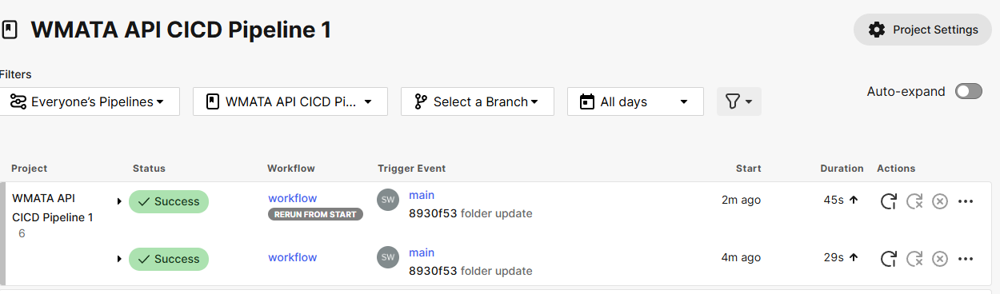

# WMATA Elevator and Escalator Incidents API

This project demonstrates setting up a continuous integration (CI) pipeline with GitHub and CircleCI using a basic Python application built with Flask. The application provides an API to retrieve elevator and escalator incidents from the Washington Metropolitan Area Transit Authority (WMATA).

Due to issues with the original WMATA API endpoint, a mock API is used for testing purposes.

## Introduction

Continuous Integration (CI) involves the automated testing of feature branches before they are merged into the main branch of a project. This ensures that the codebase remains stable and that new changes do not introduce bugs. Continuous Delivery (CD) builds upon CI by automating the release process, allowing small incremental updates to reach users faster, aligning with Agile software development practices.

This project sets up a CI pipeline with GitHub and CircleCI using a basic Flask application as an example. 

Test run was successful!

## Features

- **API Endpoints**: Retrieve incidents for elevators and escalators.
- **Unit Testing**: Ensure endpoints return correct HTTP status codes and data.
- **Continuous Integration**: Automated testing with CircleCI.

